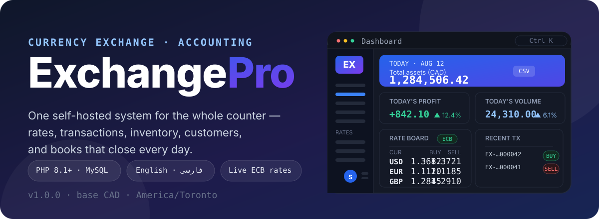
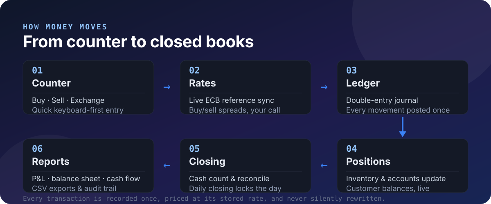

<p align="center">
  
</p>

<p align="center"><em>The hero above is a rendering of the ExchangePro dashboard interface.</em></p>

**ExchangePro** is a self-hosted currency exchange management and accounting system for bureau de change businesses. It runs the whole counter from one place — live buy/sell rates, buy/sell/exchange transactions, currency inventory, customer balances, and double-entry books with daily closing — with no monthly fees and no third-party API keys.

<p align="center">
  
</p>

---

## Features

| Area | What you get |
| --- | --- |
| **Counter** | Buy, sell and exchange transactions with fees, discounts and printable receipts. A keyboard-first **Quick** screen and a transaction **Calculator** keep operators fast. |
| **Rates** | A live rate board that auto-syncs reference rates from **Frankfurter / ECB** (no API key), applies your configured buy/sell spreads, and lets you override any rate manually. Stale and suspicious jumps are flagged, never applied silently. |
| **Inventory** | Per-currency balances across cash desk, vault, bank and wallet accounts, weighted-average costing, unrealized P&amp;L, and an inventory **Forecast** screen with min/target/max targets. |
| **Customers** | Customer records with KYC fields, per-currency receivables/payables, and a full customer ledger you can export. |
| **Accounting** | A real chart of accounts and a **double-entry journal** — every transaction posts balanced debits and credits in `DECIMAL(30,10)`. P&amp;L, balance sheet and cash-flow statements. |
| **Operations** | Cash counting by denomination, account reconciliation, inter-account transfers, and a **daily closing** workflow (open → count → close → approve) with a guard that reminds you to back up before you close. |
| **Reports** | Daily, monthly, per-currency, per-customer and inventory reports, plus profit analytics. One-click **CSV export** for transactions, customers, ledger, expenses, inventory, rates and audit. |
| **Control** | Role-based permissions, optional TOTP two-factor authentication, login rate limiting, full audit trail, and encrypted database backups with restore. |

## Why it is different

- **No SaaS, no key, no lock-in.** Plain PHP 8.1+ and MySQL 8 — deploy it on a shared host, a VPS, or a Laragon/XAMPP workstation. The installers (web *and* CLI) set everything up, and a demo dataset gets you exploring in minutes.
- **The market rate is a reference, not the answer.** Frankfurter/ECB rates are fetched automatically, but your **buy and sell prices are always your business decision** — expressed as per-currency spreads or outright manual overrides that survive the next sync.
- **Accounting, not just a register.** Because every transaction is posted to a double-entry ledger at its stored rate, profit, positions and statements always reconcile back to the same source of truth. Rates are never silently rewritten after the fact.
- **Closed book every night.** Cash counts, reconciliation and a structured daily closing make discrepancies visible while they are still fixable — and everything is recorded in an audit log.

## Quick start

### Requirements

- PHP **8.1+** with extensions `pdo_mysql`, `bcmath`, `mbstring`, `openssl` (recommended: `intl`, `gd`, `zip`, `curl`)
- MySQL **8** (or compatible)
- Writable `config/` and `storage/` directories

### Install

```bash
# clone, then serve the public/ folder (or point your web server's document root at it)
git clone https://github.com/axshuri/-ExchangePro.git exchange-pro
cd exchange-pro
php -S 127.0.0.1:8000 -t public
```

Then open **http://127.0.0.1:8000/install** and follow the web installer — it checks requirements, writes `config/config.local.php`, creates the database, seeds base data, and creates your admin account. Check **“Load demo data”** to start with sample currencies, rates, customers and transactions.

Prefer the CLI?

```bash
php database/install.php --with-demo            # default admin: admin / Admin@12345
php database/install.php --with-demo --admin-pass='YourStrongPass' --admin-email=you@example.com
```

On Windows with Laragon, double-click **`start.bat`** — it boots MySQL if needed and starts the app at `http://127.0.0.1:8000`.

> ⚠️ **Change the default admin password immediately after first login.** The installer writes `config/installed.lock`, which locks the installer to prevent remote re-installs; delete that file only to intentionally reinstall.

## Configuration

All settings are editable in the app under **Settings**, but operators can also override defaults via environment variables:

| Variable | Controls |
| --- | --- |
| `EXCHANGE_DB_HOST` / `EXCHANGE_DB_PORT` / `EXCHANGE_DB_NAME` / `EXCHANGE_DB_USER` / `EXCHANGE_DB_PASS` | Database connection |
| `EXCHANGE_BACKUP_KEY` | Encryption key for database backups — **change it before production** |
| `EXCHANGE_RATE_PROVIDER` | Rate provider (default `frankfurter`) |
| `EXCHANGE_RATE_BASE_CURRENCY` | Provider base currency |
| `EXCHANGE_RATE_API_TIMEOUT` / `EXCHANGE_RATE_CACHE_TTL` | Sync timing |
| `EXCHANGE_RATE_AUTO_SYNC` | Enable auto-sync on login / cron |

Precedence: `config/config.php` defaults → `config/config.local.php` (written by the installer) → environment variables. See `config/config.php` for all business defaults: transaction number format, large-transaction threshold, profit method, spreads, and more.

## Project structure

```
app/
  Core/          Router, MVC, auth, CSRF, database, money, i18n, installer
  Controllers/   One controller per feature area
  Services/      Ledger, rates, inventory, forecast, backups, reports, audit…
  views/         PHP views, i18n strings (en / fa)
config/          config.php (defaults) · config.local.php (local override)
database/        schema.sql · install.php · seed.php · demo_seed.php · sync_rates.php
public/          Document root — index.php, assets, PWA (installable), web installer
storage/         Backups, logs, uploads
```

## Security

- Bcrypt password hashing, session expiry, and login rate limiting (lockout after failed attempts)
- CSRF protection on every form; optional **TOTP two-factor authentication**
- Role-based access control with fine-grained permissions
- Immutable **audit log** of actions (who, what, when, from where, before/after values)
- Database backups encrypted with a key you control; the installer is disabled after setup
- Sensible business safeguards: large-transaction flagging, max rate-change guard, stale-rate warnings

## Localization

English and **فارسی (Farsi)**, including full RTL layout, plus light/dark themes and an installable PWA for counter tablets and phones.

## License

This project does not currently declare a license. If you plan to use or redistribute it, ask the repository owner before doing so.
